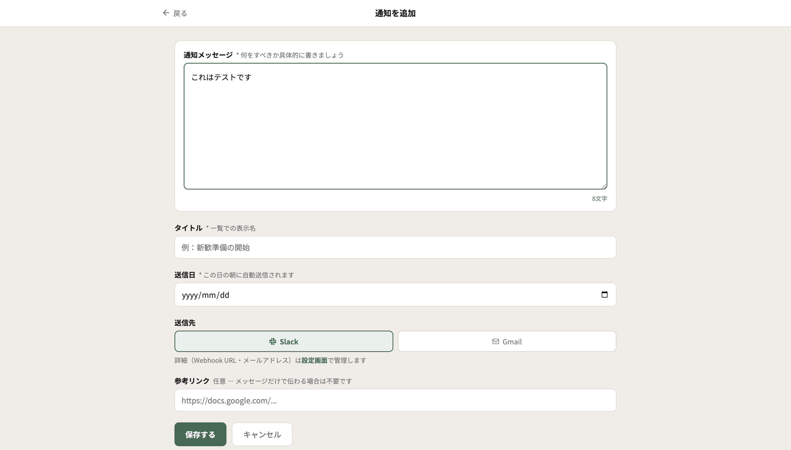
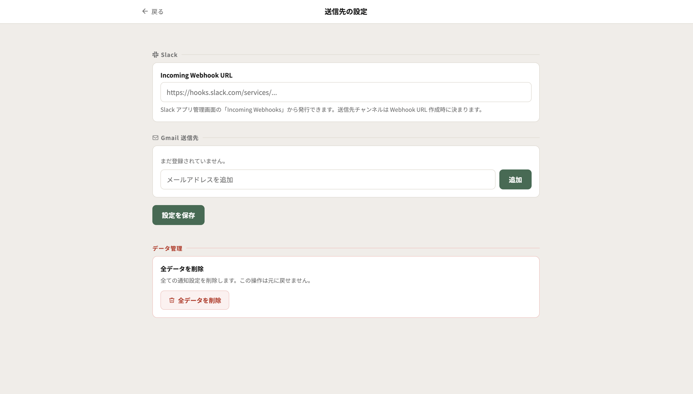
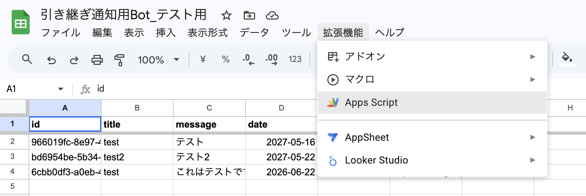
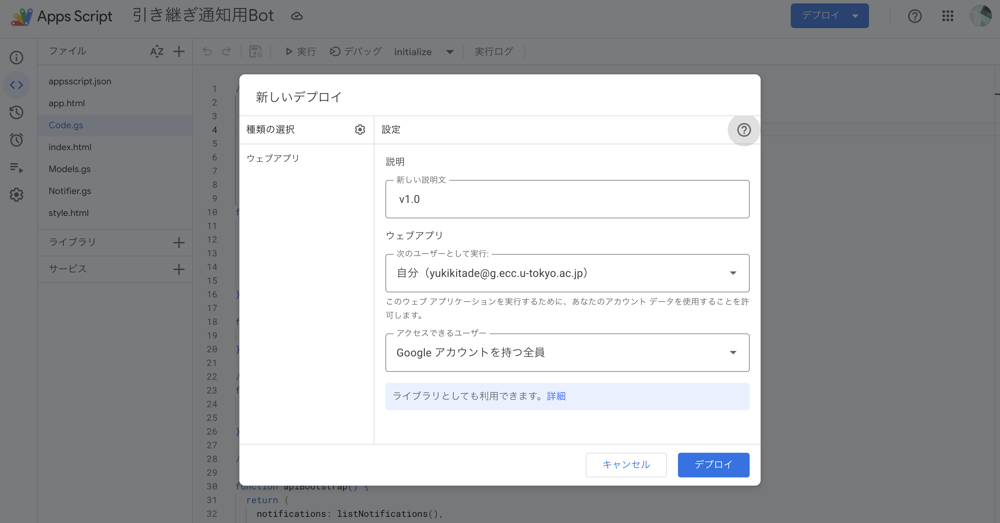

# 引き継ぎ通知Bot

サークルの役職引き継ぎを支援する自動通知ボットです。スプレッドシートに登録したスケジュールに基づいて、指定日の朝に Slack や Gmail へメッセージを自動送信します。タスク漏れを防ぎ、毎年の役職交代をスムーズに行うことを目的としています。

> **技術スタック**：Google Apps Script / Google Sheets / Slack Incoming Webhook / Gmail

---

## 📖 目次

- [このBotでできること](#このbotでできること)
- [スクリーンショット](#スクリーンショット)
- [クイックスタート](#クイックスタート)
- [使い方](#使い方)
- [ファイル構成](#ファイル構成)
- [トラブルシューティング](#トラブルシューティング)
- [設計の背景](#設計の背景)

---

## このBotでできること

- **指定日に自動通知**：登録した日の朝7時（JST）に、Slack または Gmail へ自動でメッセージを送ります
- **管理画面から通知を追加・編集・削除**：プログラミング不要の Web 画面で操作できます
- **「今すぐ送信」ボタン**：テスト送信や臨時連絡に。設定が正しいか確認するのにも使えます
- **前年度スケジュールから複製**：全通知の日付を +1 年ずらし、引き継ぎ時の手間を最小化します
- **送信先を一元管理**：Slack Webhook URL とメールアドレスは設定画面で保存。コードを直接触る必要はありません

---

## スクリーンショット

<div style="display: flex; gap: 15px; justify-content: space-between;">
	<div style="flex: 1; min-width: 0;">
		
		<p style="font-size: 0.9em; margin-top: 8px;"><strong>ホーム</strong> — 月ごとのグルーピング、即時送信・編集・削除</p>
	</div>
	<div style="flex: 1; min-width: 0;">
		
		<p style="font-size: 0.9em; margin-top: 8px;"><strong>追加・編集</strong> — シンプルな入力画面、文字数カウンター付き</p>
	</div>
	<div style="flex: 1; min-width: 0;">
		
		<p style="font-size: 0.9em; margin-top: 8px;"><strong>設定</strong> — Webhook URL とメール送信先を一元管理</p>
	</div>
</div>

---

## クイックスタート

1年に1度のセットアップです。手順通りに進めれば、プログラミング知識がなくても完了できます。

### 1. スプレッドシートを準備する

1. [Google スプレッドシート](https://sheets.google.com) を開いて、新しいスプレッドシートを作成します（または、引き継いだファイルを開きます）
2. 上部メニューから「拡張機能」 ＞ 「Apps Script」をクリック
3. GASエディタが新しいタブで開きます



### 2. スクリプトを配置する

このリポジトリの [src/](src/) 配下のファイルを GAS プロジェクトに配置します。

#### 方法A：手作業でコピペ（おすすめ）

GASエディタで以下のファイルを1つずつ作成し、このリポジトリの内容をそのまま貼り付けてください。

| ファイル名    | 種類       | 元ファイル                         |
| ------------- | ---------- | ---------------------------------- |
| `Code.gs`     | スクリプト | [src/Code.gs](src/Code.gs)         |
| `Models.gs`   | スクリプト | [src/Models.gs](src/Models.gs)     |
| `Notifier.gs` | スクリプト | [src/Notifier.gs](src/Notifier.gs) |
| `index.html`  | HTML       | [src/index.html](src/index.html)   |
| `app.html`    | HTML       | [src/app.html](src/app.html)       |
| `style.html`  | HTML       | [src/style.html](src/style.html)   |

さらに、左メニューの歯車アイコン「プロジェクトの設定」で「`appsscript.json`マニフェストファイルをエディタで表示する」をオンにし、[src/appsscript.json](src/appsscript.json) と同じ内容に書き換えてください。タイムゾーンや必要な権限スコープが含まれています。

#### 方法B：clasp を使う（開発者向け）

[clasp](https://github.com/google/clasp) を使い慣れている人は、`clasp clone` してローカルから `clasp push` でも構いません。

### 3. `initialize` を1回だけ実行する

GAS エディタ上部の関数選択ドロップダウンで `initialize` を選び、「実行」ボタンを押します。


初回は権限承認のダイアログが表示されるので、すべて許可してください（スプレッドシート読み書き / メール送信 / 外部URLアクセス / トリガー作成 の権限が必要です）。

これにより自動で以下が行われます：

- スプレッドシートに `notifications` シート（通知データ用）と `settings` シート（送信先設定用）が作成される
- 毎朝7時に自動送信を実行するトリガーが登録される

### 4. ウェブアプリとしてデプロイする

GASエディタ右上の「デプロイ」 ＞ 「新しいデプロイ」を選びます。



- **種類**：ウェブアプリ
- **次のユーザーとして実行**：自分（デプロイした本人）
- **アクセスできるユーザー**：Googleアカウントを持つ全員

「デプロイ」を押すと、ウェブアプリの URL が表示されます。この URL が管理画面の入口になります。

> ⚠️ **URLの取り扱い注意**：「アクセスできるユーザー：全員」設定では、URL を知っている Google アカウント保有者なら誰でも管理画面に入れます。サークル内で共有する人を絞り、SNS等への公開はしないでください。スプレッドシートそのものは共有不要で、共同編集者は URL だけあれば操作できます（処理はデプロイ者の権限で動きます）。

> 💡 **用語ミニ解説**
>
> - **デプロイ**：GAS を「ウェブアプリ」として公開し、URL からアクセスできるようにする操作
> - **トリガー**：決まった時刻に自動でスクリプトを動かす仕組み
> - **Webhook**：チャンネルへメッセージを投稿するための専用URL

### 5. 設定画面で送信先を登録する

ウェブアプリの URL を開き、画面右上の歯車アイコンから「送信先の設定」へ進みます。

- **Slack Incoming Webhook URL**：Slack の「アプリ管理 > Incoming Webhooks」から発行できます。送信先のチャンネルは Webhook URL を作るときに決まるので、通知ごとに切り替えることはできません
- **Gmail 送信先メールアドレス**：複数追加できます（保存時にカンマ区切りで保存されます）

入力したら「設定を保存」を押して完了です。

---

## 使い方

### 通知を追加する

1. ホーム画面右下の「通知を追加」ボタンを押す
2. **メッセージ**（必須）／**タイトル**（必須）／**送信日**（必須）／**送信先**（Slack または Gmail）／**参考リンク**（任意）を入力
3. 「保存する」を押す

「メッセージだけで内容が完結する」設計を意図しているので、リンク添付なしで自己完結する文を書くのがおすすめです。

### 通知を編集・削除する

ホーム画面の各カードに表示される「鉛筆」「ゴミ箱」アイコンから操作できます。編集画面下部にも削除ボタンがあります。

### 「今すぐ送信」する

各カードの「紙飛行機」アイコンから即時送信モーダルが開きます。送信内容のプレビューを確認したうえで送信ボタンを押すと、その場で Slack / Gmail に届きます。

- 送信後は `sent` フラグが立つ（自動送信の重複を防ぐため）
- テスト送信や臨時の手動送信に便利

### 年度引き継ぎ：前年度スケジュールから複製

新年度になったら、ホーム画面下部の「前年度スケジュールから複製」ボタンを押します。

- 全通知の **送信日を +1 年** ずらします（例：2026-03-01 → 2027-03-01）
- 全通知の **`sent` フラグをリセット**します
- タイトル・メッセージ・リンクは変わりません
- 内容を変更したい通知だけ、後から個別に編集してください

---

## ファイル構成

```
src/
├── Code.gs            # エントリーポイントとフロントエンドAPI（doGet, initialize, api*）
├── Models.gs          # スプレッドシート読み書き（CRUD と複製ロジック）
├── Notifier.gs        # Slack / Gmail 送信処理と日次トリガー
├── index.html         # ウェブアプリの土台
├── app.html           # 管理UIのフロントエンド（SPA、JavaScript）
├── style.html         # 管理UIのCSS
└── appsscript.json    # GASマニフェスト（タイムゾーン・OAuthスコープなど）
```

設計判断の詳細（なぜこの構成にしたか）：[docs/handover-bot-spec.md](docs/handover-bot-spec.md)
開発者向けのコード解説ドキュメント（図解付き）：[docs/ARCHITECTURE.md](docs/ARCHITECTURE.md)

---

## トラブルシューティング

困ったら、まず GAS エディタの「実行数」または「実行ログ」を見るとエラー内容が分かります。

| 症状                                   | 確認ポイント                                                                                                      |
| -------------------------------------- | ----------------------------------------------------------------------------------------------------------------- |
| 通知が届かない                         | GASエディタの「実行数」でエラーが出ていないか確認。設定画面で Webhook URL・送信先メールが入力済みかも見る         |
| 「Slack送信失敗」エラー                | Slack 側で Webhook URL がまだ有効か確認（チャンネル削除や Webhook 無効化が起きていないか）                        |
| 「送信先メールアドレスが未設定」エラー | 設定画面で Gmail 送信先を追加して保存                                                                             |
| トリガーがちゃんと動いているか不安     | GAS左メニューの「トリガー」を開き、`dailyTrigger` の「最終実行」時刻を確認                                        |
| 送信日になっても通知が来ない           | `notifications` シートで該当行の `sent` 列が `TRUE` になっていないか確認。手動で `FALSE` に戻せば翌朝再送されます |
| 管理画面を開くと真っ白                 | スクリプトを更新したあと、再デプロイ（「デプロイの管理」から「編集」 ＞ バージョン更新）が必要なケース            |

それでも解決しない場合は、`notifications` シートと `settings` シートの中身を直接確認すると、データの状態が一目で分かります。

---

## 設計の背景

カスタマイズする前に、設計上の主な判断とその理由を一読してください。

- **Webhook URL を UI で管理している**：スクリプトプロパティではなく管理画面から設定するようにしてあります。後任者がコードを触らずにセットアップできることを優先したためです
- **データシートを年度ごとに分けない**：「今年のデータをすぐ使える」ことを最優先し、過去年度シートは持たない設計です。複製機能で前年度から引き継ぐ運用を想定しています
- **LINE は非対応**：Messaging API のセットアップコストが高く、非エンジニアの後任者が独立して運用するゴールに合わないためです
- **メッセージをフォームの主役に**：リンク添付に頼らず、テキストだけで完結する通知を書くよう促しています
- **送信先チャンネルは通知ごとに指定しない**：チャンネルは役職ごとに固定されるケースがほとんどで、通知ごとに指定させると設定漏れ・誤送信のリスクが増すためです
- **Web App は「全員アクセス可」で運用**：複数人で通知の追加・編集を行える運用を想定し、URL を知っている人だけが管理画面に入れる設計にしています。共同編集者をスプレッドシートに招待する必要はなく、メール送信元はデプロイ者で固定されます

詳細は仕様書 [handover-bot-spec.md](handover-bot-spec.md) を参照してください。

---

## ライセンス

MIT License

詳細は [LICENSE](LICENSE) を参照してください。
