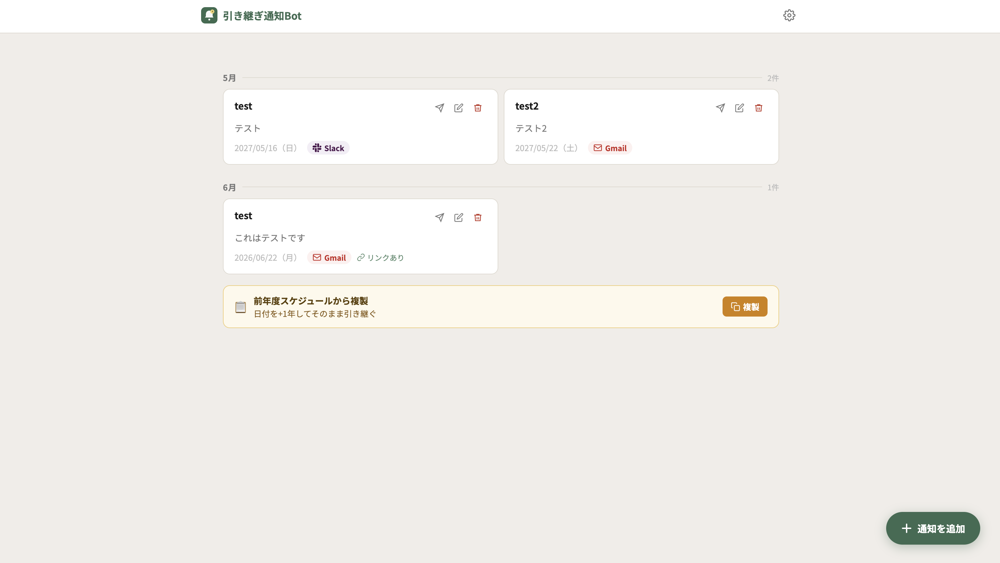

# 引き継ぎ通知Bot

サークルの役職引き継ぎを支援する自動通知ボットです。スプレッドシートに登録したスケジュールに基づいて、指定日の朝に Slack や Gmail へメッセージを自動送信します。タスク漏れを防ぎ、毎年の役職交代をスムーズに行うことを目的としています。

> **技術スタック**：Google Apps Script / Google Sheets / Slack Incoming Webhook / Gmail

---

## 📖 目次

- [引き継ぎ通知Bot](#引き継ぎ通知bot)
  - [📖 目次](#-目次)
  - [このBotでできること](#このbotでできること)
  - [スクリーンショット](#スクリーンショット)
  - [セットアップ](#セットアップ)
    - [手順の要点（4ステップ）](#手順の要点4ステップ)
  - [使い方](#使い方)
    - [通知を追加・編集・削除する](#通知を追加編集削除する)
    - [「今すぐ送信」する](#今すぐ送信する)
    - [年度引き継ぎ：前年度スケジュールから複製](#年度引き継ぎ前年度スケジュールから複製)
  - [トラブルシューティング](#トラブルシューティング)
  - [開発者向け情報](#開発者向け情報)
  - [ライセンス](#ライセンス)

---

## このBotでできること

- **指定日に自動通知**：登録した日の朝8時（JST）に、Slack または Gmail へ自動でメッセージを送ります
- **管理画面から通知を追加・編集・削除**：プログラミング不要の Web 画面で操作できます
- **「今すぐ送信」ボタン**：テスト送信や臨時連絡に。設定が正しいか確認するのにも使えます
- **前年度スケジュールから複製**：全通知の日付を +1 年ずらし、引き継ぎ時の手間を最小化します
- **送信先を一元管理**：Slack Webhook URL とメールアドレスは設定画面で保存。コードを直接触る必要はありません

---

## スクリーンショット

ホーム — 月ごとのグルーピング、即時送信・編集・削除

---

## セットアップ

セットアップは年に1度。テンプレートを使えば数分で完了します。手順は実演動画でも確認できます。

**▶ セットアップ実演動画：[動画を見る](https://drive.google.com/file/d/1On-Yh2YJ_eZBdj9w6AsVWSNLK_D-xVy_/view?usp=drive_link)**

### 手順の要点（4ステップ）

1. **テンプレートをコピーする**
   テンプレートURL：https://docs.google.com/spreadsheets/d/1Ib1CXKQyQFLHGslqBTFVh50VghzIPy5a7NsUo-CuFP8/edit?usp=sharing
   上のリンクを開き、「ファイル」→「コピーを作成」で自分の Google ドライブに保存します。

2. **初回セットアップを実行する**
   コピーしたスプレッドシートを開き、上部メニュー「**引き継ぎBot**」→「**① 初回セットアップを実行する**」をクリック。
   権限承認のダイアログはすべて許可してください（スプレッドシート読み書き / メール送信 / 外部URLアクセス / トリガー作成 の権限が必要です）。

3. **ウェブアプリとしてデプロイする**
   「引き継ぎBot」→「**② ウェブアプリのデプロイ手順を確認する**」を開き、表示されるダイアログの指示に従ってデプロイします。完了するとウェブアプリの URL が表示され、これが管理画面の入口になります。

4. **設定画面で送信先を登録する**
   ウェブアプリの URL を開き、右上の歯車アイコンから「送信先の設定」へ。Slack Webhook URL と Gmail 送信先メールアドレスを保存して完了です。

> ⚠️ **ウェブアプリURLの取り扱い注意**：URL を知っている Google アカウント保有者なら誰でも管理画面に入れます。サークル内で共有する人を絞り、SNS等への公開はしないでください。

> 💡 **用語ミニ解説**
>
> - **デプロイ**：GAS を「ウェブアプリ」として公開し、URL からアクセスできるようにする操作
> - **トリガー**：決まった時刻に自動でスクリプトを動かす仕組み
> - **Webhook**：チャンネルへメッセージを投稿するための専用URL

> テンプレートを使わずに手動で配置したい場合や、テンプレート自体を作成・更新したい場合は [docs/developer-guide.md](docs/developer-guide.md) を参照してください。

---

## 使い方

### 通知を追加・編集・削除する

- ホーム画面右下の「通知を追加」ボタンから新規作成
- 入力項目：**メッセージ**（必須）／**タイトル**（必須）／**送信日**（必須）／**送信先**（Slack または Gmail）／**参考リンク**（任意）
- 各カードの「鉛筆」「ゴミ箱」アイコンから編集・削除

### 「今すぐ送信」する

各カードの「紙飛行機」アイコンから即時送信モーダルが開きます。プレビューを確認したうえで送信ボタンを押すと、その場で Slack / Gmail に届きます。

- 送信後は `sent` フラグが立つ（自動送信の重複を防ぐため）
- テスト送信や臨時の手動送信に便利

### 年度引き継ぎ：前年度スケジュールから複製

新年度になったら、ホーム画面下部の「前年度スケジュールから複製」ボタンを押します。

- 全通知の **送信日を +1 年** ずらします（例：2026-03-01 → 2027-03-01）
- 全通知の **`sent` フラグをリセット**します
- タイトル・メッセージ・リンクは変わりません
- 内容を変更したい通知だけ、後から個別に編集してください

---

## トラブルシューティング

困ったら、まず GAS エディタの「実行数」または「実行ログ」を見るとエラー内容が分かります。

| 症状                                   | 確認ポイント                                                                                                      |
| -------------------------------------- | ----------------------------------------------------------------------------------------------------------------- |
| 通知が届かない                         | GASエディタの「実行数」でエラーが出ていないか確認。設定画面で Webhook URL・送信先メールが入力済みかも見る         |
| 「Slack送信失敗」エラー                | Slack 側で Webhook URL がまだ有効か確認（チャンネル削除や Webhook 無効化が起きていないか）                        |
| 「送信先メールアドレスが未設定」エラー | 設定画面で Gmail 送信先を追加して保存                                                                             |
| トリガーがちゃんと動いているか不安     | GAS左メニューの「トリガー」を開き、`dailyTrigger` の「最終実行」時刻を確認                                        |
| 送信日になっても通知が来ない           | `notifications` シートで該当行の `sent` 列が `TRUE` になっていないか確認。手動で `FALSE` に戻せば翌朝再送されます |
| 管理画面を開くと真っ白                 | スクリプトを更新したあと、再デプロイ（「デプロイの管理」から「編集」 ＞ バージョン更新）が必要なケース            |

それでも解決しない場合は、`notifications` シートと `settings` シートの中身を直接確認すると、データの状態が一目で分かります。

---

## 開発者向け情報

コード構成・テンプレートの作成と更新・手動セットアップ・設計判断は [docs/developer-guide.md](docs/developer-guide.md) を参照してください。

---

## ライセンス

MIT License

詳細は [LICENSE](LICENSE) を参照してください。
