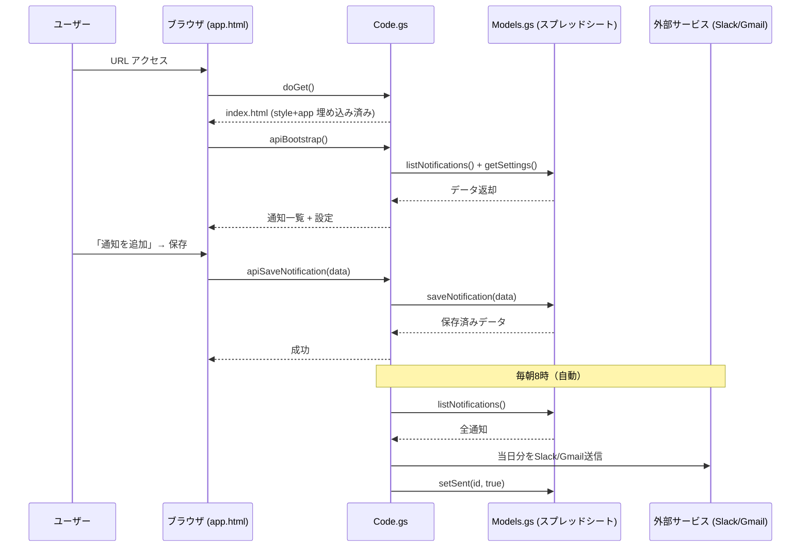

# コードベース解説

## 1. 一言で何をするコードか

**Google スプレッドシートをデータベースとして動く「引き継ぎ通知スケジューラー」。** 指定した日付に Slack または Gmail へ自動送信されるリマインダーを Web UI で管理できる Google Apps Script アプリです。

---

## 2. ファイルごとの役割と関数

### `appsscript.json` — アプリ設定（マニフェスト）

GAS プロジェクトの設定ファイル。タイムゾーン、実行ランタイム（V8）、OAuth スコープ（スプレッドシート・メール送信・外部通信など）、Web アプリの公開設定を宣言します。コードは一切含まれません。

---

### `Code.gs` — エントリーポイント & API 層

フロントエンドと GAS バックエンドをつなぐ「受付窓口」です。

| 関数 | 役割 |
|---|---|
| `onOpen()` | スプレッドシートを開くと自動で呼ばれ、「引き継ぎBot」カスタムメニューを追加する |
| `doGet()` | Web アプリの URL にアクセスされたときに `index.html` を返す |
| `include(filename)` | HTML テンプレート内で別ファイルを埋め込むためのヘルパー |
| `initialize()` | 初回セットアップ（シート作成 + 日次トリガー登録）。`setupOwner` フラグで二重実行を防ぐ |
| `showDeployGuide()` | ウェブアプリのデプロイ手順をダイアログで表示する |
| `apiBootstrap()` | 画面初期化時に通知一覧と設定を一括取得して返す |
| `apiSaveNotification(data)` | 通知の新規作成または更新 |
| `apiDeleteNotification(id)` | 指定 ID の通知を削除 |
| `apiSendNow(id)` | 指定 ID の通知を即時送信し、送信済みフラグを立てる |
| `apiGetSettings()` | 設定（Webhook URL・メールアドレス・役職名）を取得 |
| `apiSaveSettings(settings)` | 設定を保存 |
| `apiDuplicateForNewYear()` | 全通知の日付を +1 年してリセット |
| `apiDeleteAll()` | 全通知を削除 |

---

### `Models.gs` — データ層（スプレッドシート操作）

スプレッドシートを CRUD する「データベース操作クラス」です。`notifications` シートと `settings` シートの 2 枚を管理します。

```
notificationsシート列: id | title | message | date | dest | sent
settingsシート列:       key | value
```

| 関数 | 役割 |
|---|---|
| `ensureSheets()` | シートが存在しなければ作成し、ヘッダー行・書式を設定 |
| `getSheet_(name)` | 名前でシートを取得するプライベートヘルパー |
| `rowToObj_(row)` | スプレッドシートの行配列 → JavaScript オブジェクトに変換（型正規化も行う） |
| `objToRow_(obj)` | JavaScript オブジェクト → 行配列に変換 |
| `listNotifications()` | 全通知を配列で返す |
| `getNotification(id)` | ID で 1 件取得 |
| `findRowById_(id)` | ID からシート上の行番号を返すプライベートヘルパー |
| `saveNotification(data)` | id なし → 新規追加、id あり → 行を上書き更新 |
| `deleteNotification(id)` | 指定行を削除 |
| `setSent(id, sent)` | sent 列だけを更新（送信済みフラグの立て方） |
| `getSettings()` | settings シートをキーバリューとして読み込む |
| `saveSettings(settings)` | settings シートを一旦クリアして全上書き |
| `duplicateForNewYear()` | 全行の日付を +1 年・sent を false にリセット |
| `deleteAllNotifications()` | ヘッダー行以外の全行を削除 |

---

### `Notifier.gs` — 通知送信 & 定期トリガー

実際にメッセージを外部へ送信する「配送担当」です。

| 関数 | 役割 |
|---|---|
| `sendNotification(notification)` | `dest` フィールドで Slack/Gmail を振り分けて送信 |
| `sendToSlack_(notification, webhookUrl)` | Incoming Webhook に JSON POST |
| `sendToEmail_(notification, addresses)` | CSV のアドレスをパースして `MailApp.sendEmail()` |
| `dailyTrigger()` | 時間主導トリガーから毎朝呼ばれる。今日の日付に一致する未送信通知を全件送信 |
| `setupDailyTrigger()` | 毎朝 7 時に `dailyTrigger` を実行するトリガーを登録（重複削除してから再登録） |

---

### `index.html` — HTML シェル

ページの骨格だけを持つファイル。`<?!= include('style'); ?>` と `<?!= include('app'); ?>` の GAS テンプレート記法で style.html と app.html を埋め込みます。

---

### `app.html` — フロントエンド SPA（メインロジック）

画面描画・操作のすべてを担う 580 行の JavaScript。即時関数（IIFE）でスコープを閉じた SPA です。

**状態管理**

| 変数/関数 | 役割 |
|---|---|
| `state` | アプリ全体の状態（現在画面・通知一覧・設定・ローディングフラグなど） |
| `setState(patch)` | state を更新して `render()` を呼ぶ（React の setState に相当） |

**ユーティリティ**

| 関数 | 役割 |
|---|---|
| `call(name, ...args)` | `google.script.run` を Promise でラップ |
| `escapeHtml(s)` | XSS 防止のための HTML エスケープ |
| `formatDate(s)` | `2025-04-01` → `2025/04/01（火）` 形式に変換 |
| `groupByMonth(notifications)` | 通知を月ごとにグループ化 |
| `showToast(msg, isError)` | 画面下部に一時的な通知を表示 |
| `badgeHtml(dest)` | Slack/Gmail バッジの HTML を返す |
| `parseEmails(csv)` / `joinEmails(arr)` | CSV ↔ 配列の変換 |
| `runAction(fn, opts)` | 非同期処理の busy 制御・エラートースト表示を共通化 |

**画面描画**

| 関数 | 役割 |
|---|---|
| `render()` | `state.screen` に応じて対応する `render*()` を呼び出し `innerHTML` を更新 |
| `renderTopbar(left, center, right)` | 3 列トップバーの HTML を生成 |
| `renderList()` | 通知一覧画面（月別グループ） |
| `renderCard(n)` | 通知 1 件のカード HTML |
| `renderEdit()` | 追加/編集フォーム画面 |
| `renderSettings()` | 設定画面（役職名・Webhook URL・メール一覧） |
| `renderTestModal()` | 「今すぐ送信」確認モーダル |

**イベント処理**

| 関数 | 役割 |
|---|---|
| `bindEvents()` | `data-action` 属性を持つ要素にクリックハンドラを一括登録 |
| `handleAction(e)` | `data-action` の値で処理を振り分けるスイッチ |

**アクションハンドラ**

| 関数 | 役割 |
|---|---|
| `openEdit(id)` | 編集フォームを対象データで開く |
| `openTest(id)` | 送信確認モーダルを開く |
| `selectDest(dest)` | 送信先（Slack/Gmail）をトグル |
| `captureForm()` | フォームの現在値を `state.editTarget` に反映 |
| `refreshState()` | `apiBootstrap` を再呼び出しして state を最新化 |
| `saveForm()` | バリデーション → 保存 API 呼び出し → 一覧へ戻る |
| `doDelete(id)` | 確認ダイアログ → 削除 API 呼び出し |
| `doSendNow(id)` | 即時送信 API 呼び出し → モーダルを成功表示に切替 |
| `doDuplicate()` | 全通知を +1 年複製 |
| `mutateEmailList(fn)` | メールリストを関数で変更するヘルパー |
| `addEmail()` / `removeEmail(index)` | メールアドレスの追加/削除 |
| `captureSettingsInput()` | 設定フォームの値を state に反映 |
| `saveSettingsForm()` | 設定を保存 |
| `doDeleteAll()` | 二重確認 → 全データ削除 |
| `init()` | 初回ロード時に `apiBootstrap` を呼び出して状態を初期化 |

---

## 3. 処理の流れ（Mermaid）



---

## 4. 潜在的な改善点

**データ取得の効率**
`getNotification(id)` が `listNotifications()`（全件取得）の後に `find()` しているため、件数が増えると遅くなります。`findRowById_` のように ID 列だけ先に読む方式に統一すると改善できます。

**`saveSettings` の全上書き方式**
設定保存時に一旦クリアして書き直しているため、将来キーが増えると管理しにくくなります。キーごとに行を探して上書きする方式の方がロバストです。

**フロントエンドの `innerHTML` 全再描画**
`render()` のたびに `root().innerHTML` を全書き換えしているため、フォームカーソル位置やスクロール位置がリセットされる可能性があります（特に `selectDest` 切替時）。`captureForm()` で値を退避しているのはその対策ですが、差分更新があればより自然な UX になります。

**エラーハンドリングの粒度**
`dailyTrigger` 内のエラーは `console.error` だけで握りつぶされます。送信失敗時に管理者へメールを飛ばすなどのフォールバックがあると運用上安心です。
